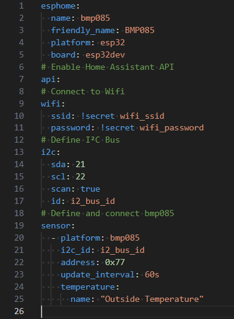
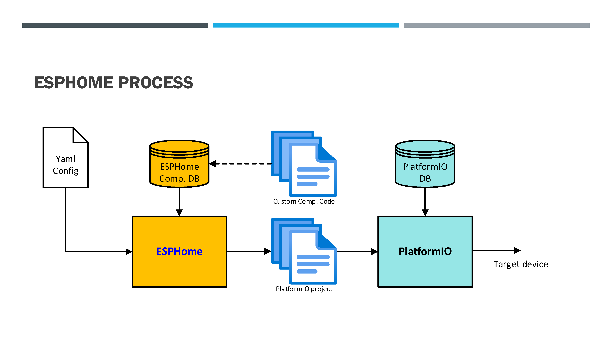

# ESPHome component design : Overview

## Introduction

Terminology:

- A **device** refers to a set of **components** grouped together by a user to perform a specific function.
- A **component** is a basic element of the ESPHome library. It can be a physical component, such as a temperature sensor, or a logical component, such as an I²C bus.

The main purpose of ESPHome is to enable **users** with no particular computer skills to automatically create the software for an electronic module. To do this, the user describes the module’s configuration in a YAML file. ESPHome then uses a library of components which it assembles according to the user’s needs, automatically generating the firmware required for the module to function correctly. The user must then assemble the various components on an electronic board and connect it to a computer to load and execute the code generated by ESPHome.

On the other end a **developer** will create new components to enrich the ESPHome library. However, this task is much more complex, as it involves describing the component’s behavior using the C++ and Python languages. A good knowledge of C++ and the basics of Python are required to complete this task.

Having been faced with the need to create new components that didn’t exist in the ESPHome library, I wondered about the steps and tools required to complete this task. Although there are many tutorials on creating **devices** in ESPHome, very few deals with creating **components**. I therefore proceeded by trial and error to finally establish an environment and a process to use. This experience has given me some valuable knowledge, which I’d now like to share.

It’s worth noting that there are certainly other (_and probably better_) methods for accomplishing this task.

## **ESPHome's high-level vision**

First, let me introduce you to how ESPHome works at a high level of abstraction, as I understand it.
When creating a new **device** in ESPHome, you must first define all the components you wish to use and specify how they will be interconnected. For example, if you want to design a "room temperature measurement" module, here’s how you might describe it: You will indicate that you wish to install an ESP32 microcontroller on an esp32dev development board, which will be connected to a BMP085 sensor via an I²C bus. This sensor will be responsible for measuring temperature, then sending this data to Home Assistant via ESPHome’s native API using a Wi-Fi connection.

The Yaml file will look like this:

In this file, we indicate that we’re creating a new ESPHome module called "test-bpm085", that the microprocessor used is an "ESP32", which is mounted on an "esp32dev" development board, that the module connects to your "Wi-Fi" network, that it communicates with Home Assistant using the "native api protocol", that it uses an "I2C" bus, and that the "BMP085 sensor" connected to the I²C bus returns the temperature.

Based on this description, ESPHome works its magic by performing the following tasks:

- First, ESPHome reads the Yaml file. This enables it to list all the components used and to know all the interconnections (internal creation of a netlist). In this phase, ESPHome checks the syntax and semantics of the Yaml file. This is the preparation and verification phase.
- Secondly, ESPHome searches its library for all the components used in the module. For example a Wifi component, an I2C component, an Api component, a BMP085 component, a sensor component, and so on. It then copies the source code of these components into a directory created specifically for the module being assembled.
- It then generates a C++ file (main.cpp) to "instantiate" and "connect" the components from the internal netlist. This is the code generation phase. During this phase, ESPHome also generates all the necessary environment for PlatformIO.
- It then launches PlatformIO, which will create, download and run the resulting firmware on the hardware target.

This diagram describes the process:

So, to summarize, once the configuration file has been validated, the source files for the various components used are copied into the PlatformIO project directory, a main.cpp file and the _plaformio.ini_ file are generated, and control is handed over to PlatformIO.
PlatformIO begins by checking that the necessary development environment, such as compilers, libraries, programming utilities, etc., are present and up to date (the environment is specified in the configuration file platformio.ini generated by ESPHome). PlatformIO will then compile and download the resulting code to the target device.

___
In this series of presentations, we’re going to take a look at the **creation** of components, not their **use**.

The steps are the following :

- Writing documentation to show users how to use your component.
- Writing Python files to validate and generate C++ code from the configuration file.
- Writing C++ files to "model" the component. This part of the development process is the longest and most complex, since it requires a detailed analysis of the component specifications and a minimum understanding of ESPHome’s internal architecture, in order to write the code that will model the component’s behavior.
- Submitting your new component to the ESPHome library. It’s in this phase that your code and documentation will be scrutinized to check that you comply with ESPHome’s very strict constraints. Ultimately, your component must be approved by a person with privileged rights...
- Although it is not mentioned anywhere, it seems that when you add a new component to ESPHome it is implicitly understood that you are committed to maintaining this component (bug fix and enhancement). note that your GitHub developer name is associated with the component.

___

- [Introduction's document in English](/Part1-introduction/part1-introduction-en-US.pdf)
- [Document d'introduction en Français](/Part1-introduction/part1-introduction-fr-FR.pdf)
- [Video in French](https://youtu.be/cindv-3cWSg)
- [Complete example directory](/Part1-introduction/bmp085-project)
