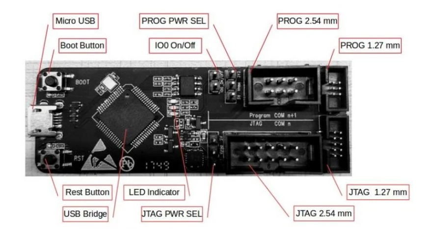
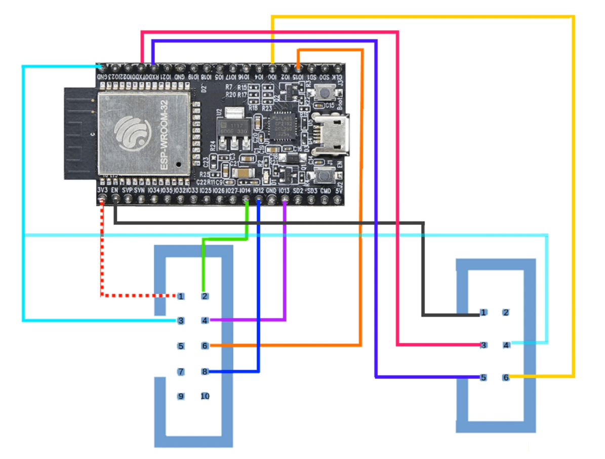
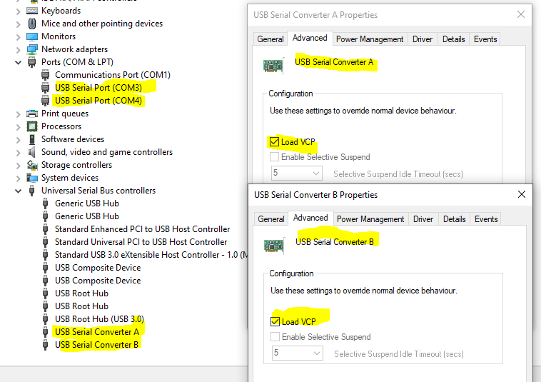
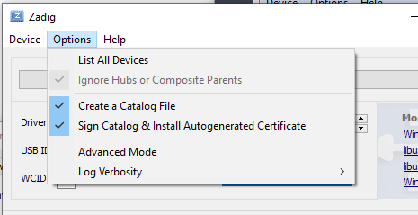
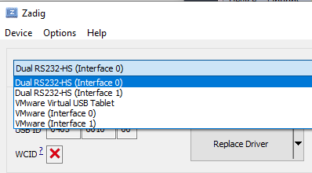
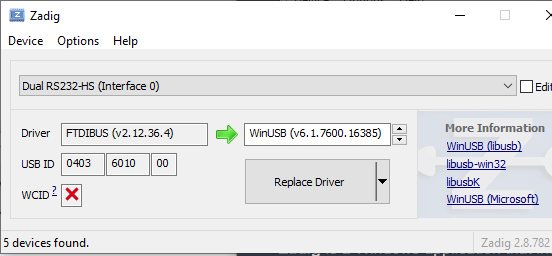

# title

## Basic Equipment

To upload and verify that a module works correctly, you will need the following items:

- A computer: You need a computer that you connect to the development board via a USB cable to load the software, run its execution, and receive data from the device.

- An **ESP** development board: There are many models of ESP development boards. You need to choose a board based on your needs.

- A breadboard or prototyping PCB: This allows you to connect all the necessary electronic components for your development. Generally, you start with a breadboard because it provides maximum flexibility for experimenting with your setup. Later on, you can solder the components onto a prototyping PCB, which makes it easier to conduct in-situ tests. Once your design is finalized, it might be beneficial to have a PCB manufactured, especially if the setup is somewhat complex.

- Measurement and analysis tools: You'll require basic equipment to measure voltages, current, resistance, capacitance, etc. Having an oscilloscope and a logic analyzer can be useful for visualizing and analyzing analog and digital signals at different points in the circuit. Personally, I use a portable Hantek 2C42 oscilloscope from the Hantek brand with two channels, as well as a 16-channel logic analyzer from Kingst. This analyzer not only stores  and analyzes logic signals but also incorporates various protocol decoders, such as the I²C protocol, allowing you to visualize I²C frame contents.

## Debugging Board

During the debugging phase, it's crucial to verify that the board functions as intended by analyzing the results, for instance, from Home Assistant.

When there's an issue, you can always add debug messages to display the values of internal variables in the program. This is known as 'print debugging', but it quickly reaches its limits. For effectively debugging a somewhat complex program, especially while developing a new component, using a hardware debugging board is recommended. This board enables you to set breakpoints in the program and check variable values during execution.

Several debugging boards are available for ESP32 microcontrollers. I personally use the following boards:

### [ESP-PROG](https://docs.platformio.org/en/latest/plus/debug-tools/esp-prog.html)

This board facilitates downloading, executing, and debugging ESP32 micro-controllers via a simple USB connection to the computer.

It integrates both the programmer and debugger part. You can directly connect it to an ESP32 development board to download the program and start debugging through a single USB connection.

It communicates with the ESP module through JTAG ports, enabling real-time loading and debugging (see [JTAG
Debugging](https://docs.espressif.com/projects/esp-idf/en/latest/esp32/api-guides/jtag-debugging/index.html)).
This allows you to set breakpoints, inspect variables, stack traces, etc., thereby simplifying the development process.



### [ESP-WROVER-KIT V4.1](https://docs.espressif.com/projects/esp-idf/en/latest/esp32/hw-reference/esp32/get-started-wrover-kit.html)

Another alternative I use is the ESP-WROVER-KIT V4.1 development board. It serves as both an ESP32 development board and an integrated hardware debugger board. It uses the same components as the ESP-PROG board.


## Wiring the ESP-PROG board

The [ESP-PROG](https://espressif-docs.readthedocs-hosted.com/projects/esp-dev-kits/en/latest/other/esp-prog/user_guide.html) board is connected to a computer via a USB port and features an [FTDI2232HL](https://ftdichip.com/products/ft2232hl/) circuit with two serial channels ([see board diagram](https://espressif-docs.readthedocs-hosted.com/projects/esp-dev-kits/en/latest/_static/esp-prog/schematics/SCH_ESP32-PROG_V2.1_20190709.pdf)). The first channel is used to drive the JTAG pins to the target board, and the second channel is used to dialogue with the target board's serial link. The wiring between the two boards is as follows:


![image](./images/image4.jpeg'

### Connecting the program interface

| **Pin ESP_PROG Serial** | **Name** | **Name** | **Pin ESP WROVER**[^1] |
|-------------------------|----------|----------|------------------------|
| 1                       | ESP_EN   | EN       | 2                      |
| 2                       | VDD      | 3.3v     | 1                      |
| 3                       | ESP_TX   | TX       | 37                     |
| 4                       | GND      | GND      | 21                     |
| 5                       | ESP_RXD  | RX       | 36                     |
| 6                       | ESP_IO0  | IO_0     | 27                     |

### Connecting the JTAG interface

| **Pin ESP_PROG JTAG** | **Name** | **Name** | **Pin ESP WROVER** |
|-----------------------|----------|----------|--------------------|
| 1                     | VDD      |          |                    |
| 2                     | ESP_TMS  | OI_14    | 12                 |
| 3                     | GND      |          |                    |
| 4                     | ESP_TCK  | IO_13    | 14                 |
| 5                     | GND      |          |                    |
| 6                     | ESP_TDO  | IO_15    | 25                 |
| 7                     | GND      |          |                    |
| 8                     | ESP_TDI  | IO_12    | 11                 |
| 9                     | GND      |          |                    |
| 10                    | NC       |          |                    |

To summarize, connect the JTAG interface to input/output pins IO-12, IO-13, IO-14 and IO-15. The program interface is connected to pins En, IO-0, RX, TX, 3.3 V and ground. With this set-up, all the components on the development board are automatically powered via the computer's USB socket.

## Installing drivers for the ESP-PROG card

Once you've completed the hardware installation, you now need to install the drivers required for the system to work properly. This installation is described in detail in the [PlatformIO documentation: Dual RS232 HS](https://docs.platformio.org/en/stable/plus/debug-tools/esp-prog.html)

Installation is simple but delicate, so it's important to follow the steps carefully:

1. Install the FTDI2232HL driver before connecting the ESP-PROG card. To do this, install the [VCP (Virtual Com Port) driver for Windows](https://ftdichip.com/wp-content/uploads/2021/08/CDM212364_Setup.zip). If you have not installed this driver before connecting the card, Windows will normally search for it automatically. In this case, check that the FTDI driver is installed.

2. Open the Device Manager and connect the ESP-PROG card to your computer via a USB cable. You should now see two new USB bus controllers, called 'USB serial converter A' and 'USB serial converter B' respectively. You should also see two new serial ports called 'USB serial port (COMxx)' and 'USB serial port (COMyy)'.

3. If you can't see the serial ports, right-click on the 2 ports 'USB serial converter A and B' and select the property command. In the window that opens, go to the Advanced tab and check the 'load VCP' box. Disconnect and reconnect the ESP-PROG card, and the serial ports should now appear.



4. So that the first serial port can be used to send JTAG commands, you need to install a special driver other than the FTDI one. To do this, go to the [Zadig](https://zadig.akeo.ie/) site, which lets you install a 'generic USB' driver. Download and run the latest version of the application. In the window that opens, select the options menu and click on 'List All Devices'. Click on the list of devices and select 'Dual 232HS (interface 0)




Zadig indicates that the FTDIBUS driver is currently installed. Check that the WinUSB driver to the right of the arrow is selected (if not, select it). Click on 'Replace Driver' and wait, as this operation may take some time (up to five minutes).



5. When the operation is complete, return to the Device Explorer. The 'USB Serial Converter A' and one of the serial ports should have disappeared. Instead, you should find a 'Dual RSHS' in the 'Universal Serial Bus Devices' category.


6. Note the value of 'USB serial port' (COM4 in my example).

We're now ready to download firmware onto our development board and start the hardware debugging!

## PlatformIO project configuration

To compile projects that can be debugged, we need two build configurations in platform.ini: one for 'Release', and one for 'Debug'.

As the two configurations will share most of their parameters, we have a common section to hold these shared parameters:

```python
\[common\]
platform = https://github.com/platformio/platform-espressif32.git
board = esp-wrover-kit
framework = arduino
monitor_port = COM4
monitor_speed = 115200
; upload through the serial port
upload_port = COM4
upload_speed = 921000
; alternatively we can upload through the JTAG
; upload_protocol = esp-prog

\[env:Release\]
platform = \${common.platform}
board = \${common.board}
framework = \${common.framework}
monitor_port = \${common.monitor_port}
monitor_speed = \${common.monitor_speed}
upload_port = \${common.upload_port}
upload_speed = \${common.upload_speed}

\[env:Debug\]
platform = \${common.platform}
board = \${common.board}
framework = \${common.framework}
monitor_port = \${common.monitor_port}
monitor_speed = \${common.monitor_speed}
upload_port = \${common.upload_port}
upload_speed = \${common.upload_speed} build_type = debug
debug_tool = esp-prog
debug_init_break = tbreak setup ; break when entering setup()
; debug_speed = 500
```

### Quick test of debugging environment

To check that everything was working properly, I created a small test project using PlatformIO. I've written a simple, classic program that flashes the LED on the development board and writes a message to the log console. This will enable us to check that the program has loaded correctly and that the output is displayed correctly in the console. To illustrate the inspection capabilities of PlatformIO's debugger, my
program uses two classes.

```c++
\#include \<Arduino.h\>
\#ifndef LED_BUILTIN
\#define LED_BUILTIN 2
\#endif

class Time {
public:
    Time() : time\_{0} {}
    Time(int time) : time\_{time} {}
    auto time() -\> int & { return time\_; }
    auto time() const -\> const int & { return time\_; }

private:
    int time\_; 
};

class Clock : Time {
public:
    Clock() : Time(), tick\_{1000} {}
    Clock(int tick) : Time(), tick\_{tick} {}
    Clock(int tick, int time) : Time(tick), tick\_{tick} {}
    auto tick() & -\> int & { return tick\_; }
    auto operator()() const -\> const int & { return time(); }
    auto operator++(int) -\> void { time() = time() + tick\_; }

private:
    int tick\_;
};

char str\[50\];
Clock clk{500};

void setup() {
}

void loop() {
    digitalWrite(LED_BUILTIN, HIGH);
    delay(clk.tick());
    clk++;
    digitalWrite(LED_BUILTIN, LOW);
    delay(clk.tick());
    clk++;
    sprintf(str, 'Current time %.2f second%c', clk() / 1000.0, clk() \< 2000 ? ' ' : 's');
    Serial.println(str);
}

[^1]: This is a guideline only, as it varies according to the kit used.
